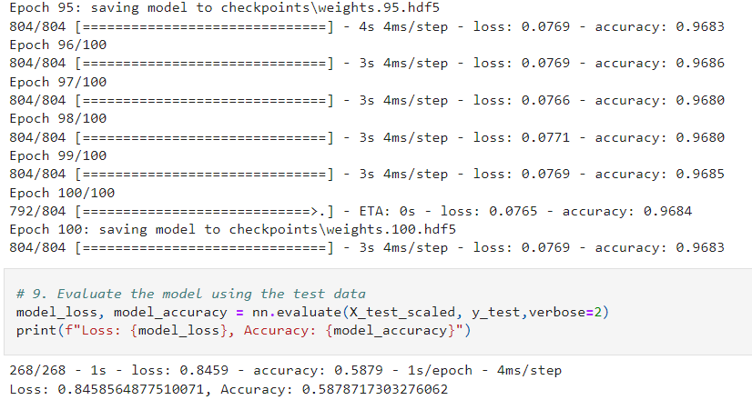
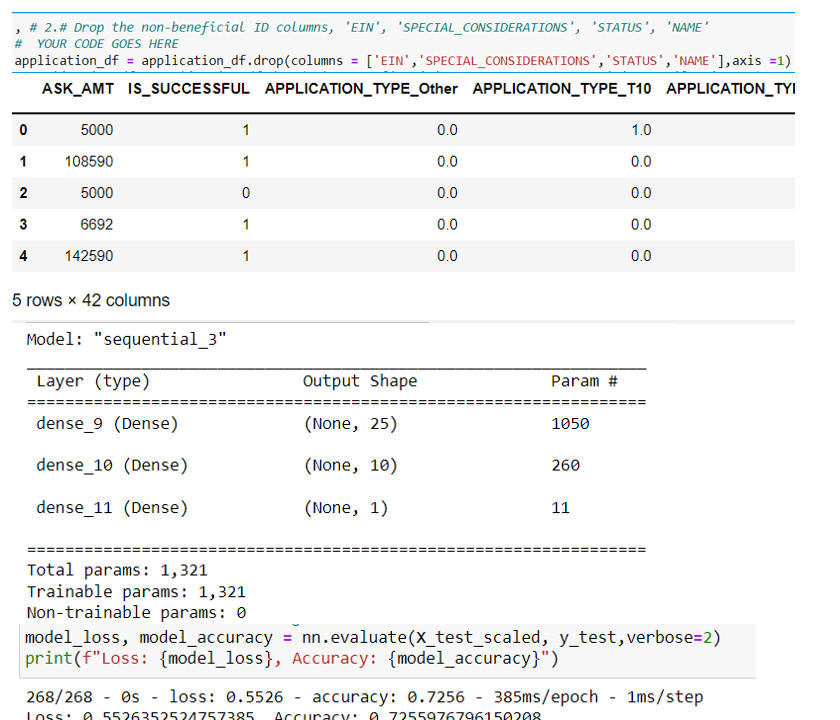

# Neural_Network_Charity_Analysis
To create a binary classifier that is capable of predicting whether applicants will be successful if funded by Alphabet Soup
## Overview of the analysis: 
This project uses Neural Networks machine learning algoritms to accomplish fund prediction analysis for a non-profit. 
### Purpose:
Main purpose is to find out if funding is received if the NGO would be successful meaning if the funding is used effectively.
### Tools:
Using Python as a language, jupyter notebooks as a web app and TensorFlow, Pandas, Scikit-learn libraries. 
## Results: 
To find out if a non-profit would be successful if were to receive the fund each organization's metadata is captured. Using NN I will be able to train and evaluate the model. 
There are one input layer, one output layer and in some solutions 2 and some 3 hidden layers are used. Input layer has 42 columns. Hidden layers use 25, 10  neurons for each layer and creates in total of 1321 parameters. During the training of the model with each epoch training accuracy increases and loss of data decreases. Once the model is evaluated with test data the accuracy and loss are very similar to the result I had without optimization.

This image below shows the high value of accuracy and low data loss when I use 19612 columns of data which produces 529, 728 parameters with two hidden layers in Keras model and 27, and 7 neurons for each layer. But the result of evaluation with the test data is very low and the loss is very high. Which tells me that this is overfitting the data.

I've included the 4 different.html (.jpynb) files to be able to see the different results with different optimizations using number of input, neurons, layers, epochs etc.

__Data Preprocessing__
- What variable(s) are considered the target(s) for your model?
Target variable is the IS_SUCCESSFUL column, which is the output.
- What variable(s) are considered to be the features for your model?
Features are all the columns in the dataset excluding the output/target column and the ones that the model doesn't need to use and can be dropped. In my optimization code I used 5 different columns to drop to see if number of features and parameters would effect the result. It does effect the training result but not the evaluation result for accuracy or data loss.
- What variable(s) are neither targets nor features, and should be removed from the input data?
Using features that has too many unique values ie the columns below. EIN                       34299
NAME                      19568
These columns should be dropped because One-Hot Encoding becomes a big problem in such a case since we have a separate column for each unique value in the categorical variable. In one of the cases 'NAME' column created in total over 19 thousand columns. Also in some columns column contains a lot of “repeats” in its data range ie. 'SPECIAL_CONSIDERATIONS','STATUS' columns in the dataset. I dropped the high and low cardinality values and then run the One-Hot Encoding to be able to optimize the model.

__Compiling, Training, and Evaluating the Model__
- How many neurons, layers, and activation functions did you select for your neural network model, and why?
I used different number of neurons for different tests as seen in the .html files I added. There is no concreate rule to use of number of neurons but I tried 2/3 of the features as number of neurons for the first layer and less than half of it for the second layer. In the submitted solution I used 2 layers, 25, 10  neurons for each respective layer. Activation functions are 'relu' for the layers and 'sigmoid for the output layer. 
- Were you able to achieve the target model performance?
I used the Keras model. I was not able to go over 73 percent accuracy in any of the optimizations. The loss remained around 55% and accuracy 73%.
- What steps did you take to try and increase model performance?
I used dropping high and low cardinality columns. I used 2 or more layers. I used 100 and less neurons. I used 250 and 100 epochs.

The image below shows the Keras model used for the Alphabet Soup funding. It summarizes the input/columns, number of parameters, layers and neurons I used.

## Summary: 
In summary the Keras model I used with different optimizations using relu activation, adam optimizer, binary cressentropy for the loss function, 250 and 100 epochs, 1321 parameters, with high and low number of neurons resulted in similar evaluation of the model with the test data. In some cases the training data was able to achieve over 95% accuracy but the test data evaluation was about only 56% which suggested that the training caused overfitting the data. The overall results of the deep learning model showed me that NN needs lots of computation and time and trying different optimizations.

__Recommendation:__
 Using a different model may solve this classification problem of having high data loss and low accuracy. I could recommend using supervised ML and comparing the results with unsupervised NN. Adding more inputs/columns for the NN model may also give higher accuracy but it will have computation issues.
